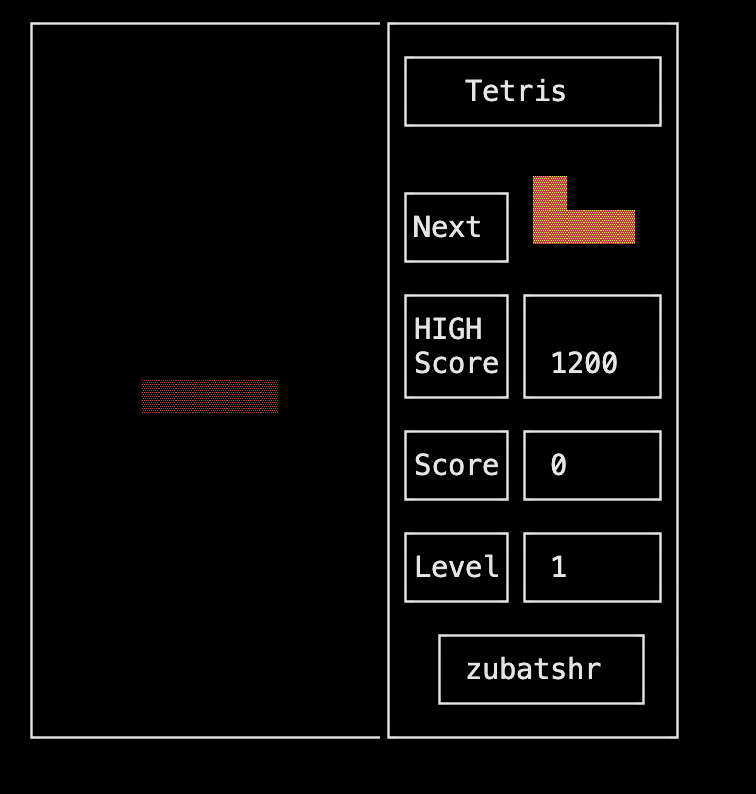
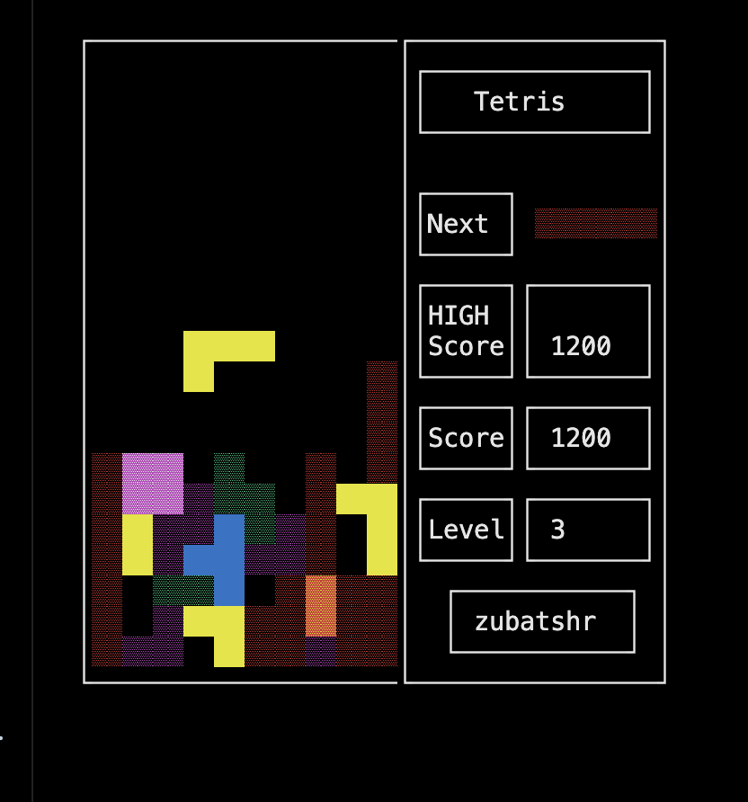

# s21-brickgame_v1.0
Проект School 21 на языке C. Тетрис

Реализация игры Тетрис
- Программа должна состоять из двух частей: библиотеки, реализующей логику игры тетрис, и терминального интерфейса с использованием библиотеки `ncurses`.
- Для формализации логики игры должен быть использован конечный автомат.
- Библиотека должна иметь функцию, принимающую на вход ввод пользователя, и функцию, выдающую матрицу, которая описывает текущее состояние игрового поля при каждом ее изменении.
- В игре присутствуют следующие механики:
  - Вращение фигур;
  - Перемещение фигуры по горизонтали;
  - Ускорение падения фигуры (при нажатии кнопки фигура перемещается до конца вниз);
  - Показ следующей фигуры;
  - Уничтожение заполненных линий;
  - Завершение игры при достижении верхней границы игрового поля;
  - В игре должны присутствовать все виды фигур, из классической игры тетрис.
- Для управления добавь поддержку всех кнопок, предусмотренных на физической консоли:
  - Начало игры,
  - Пауза,
  - Завершение игры,
  - Стрелка влево — движение фигуры влево,
  - Стрелка вправо — движение фигуры вправо,
  - Стрелка вниз — падение фигуры,
  - Стрелка вверх — не используется в данной игре,
  - Действие (вращение фигуры).
- Игровое поле должно соответствовать размерам игрового поля консоли — десять «пикселей» в ширину и двадцать «пикселей» в высоту.
- Фигура, после достижения нижней границы поля или соприкосновения с другой фигурой, должна остановиться. После этого происходит генерация следующей фигуры, показанной на превью.
- Интерфейс библиотеки должен соответствовать описанию, которое находится в materials/library-specification_RUS.md.
- Пользовательский интерфейс должен поддерживать отрисовку игрового поля и дополнительной информации.
- Подготовь в любом формате диаграмму, описывающую используемый КА (его состояния и все возможные переходы).
- make dvi - создаст документаци. по проекту

Пример работы программы:

--

